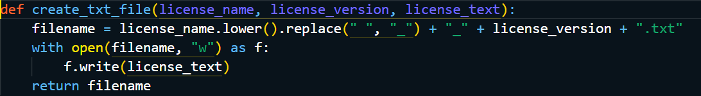
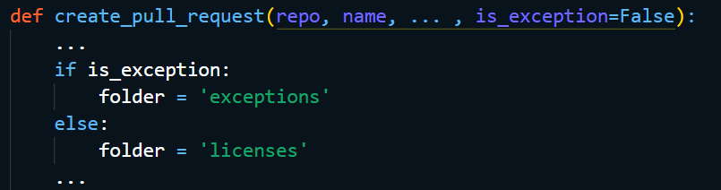
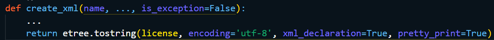
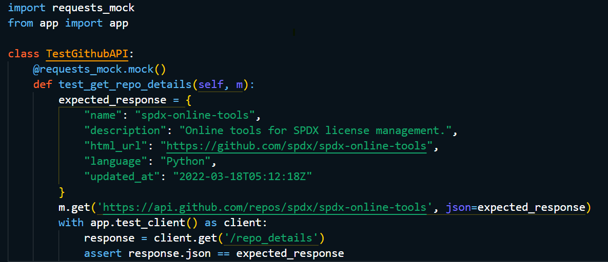
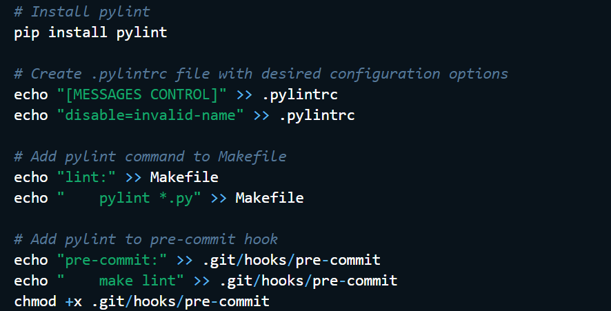

**Table of Contents**

# **Basic Information**

**Name:** Vedant Jatin Jolly

**University:** Sardar Patel Institute of Technology, Mumbai University

**GitHub:** [\@BassCoder2808](https://github.com/BassCoder2808)

**Gitter Id:**
[\@basscoder2808](mailto:@basscoder2808-5ef99115d73408ce4fe829ed:gitter.im)

**Email:** <vedantjolly2001@gmail.com>

**Phone:** (+91) 9004012177

**Postal Address:** Flat no 402, Rail Mitra, Plot no 125, Sector 1,
Charkop, Kandivali (W), Mumbai, 400067, Maharashtra, India

**Timezone:** Indian Standard Time (UTC +5.30)

# **Project SPDX License Submission Online Tool - increase functionality**

## 

## **Abstract**

The SPDX-legal team currently relies heavily on the \"submit new
license\" online tool, which is accessed at https://tools.spdx.org/app/.
This tool creates a new issue in the SPDX License List GitHub repository
whenever someone uses it to submit a new license. While the online tool
has good capabilities for creating the XML file necessary for licenses
that have been accepted to the SPDX License List and submitting a pull
request (PR) to the GitHub repository, there are several areas that
could be improved upon. The aim of this project is to enhance the online
tool\'s functionality and increase the efficiency of license submissions
while easing the workload of the SPDX-legal team.

## **Background**

The SPDX Online Tools is a project that provides an online toolset for
creating SPDX (Software Package Data Exchange) documents. SPDX is a
standard format for communicating the components, licenses, and
copyrights associated with a software package. It was developed by the
Linux Foundation\'s SPDX workgroup to improve the efficiency and
accuracy of software license compliance. The toolset includes features
for creating new SPDX licenses, creating SPDX files for software
packages, and validating SPDX files. The SPDX Online Tools project is
particularly important for organizations that use open-source software,
as it provides a streamlined way of creating and sharing SPDX files.
This is important for ensuring compliance with open-source licenses,
which can be complex and difficult to manage. Overall, the SPDX Online
Tools project is an important tool for anyone involved in software
licensing and compliance, providing an efficient and user-friendly way
of creating and managing SPDX files.

## **Motivation**

I am passionate about open-source software and the importance of
compliance with open-source licenses. The SPDX Online Tools project
provides a valuable toolset for organizations to manage and communicate
software licenses effectively. Additionally, the project has a strong
community of contributors and is actively maintained, which means that I
will have the opportunity to work with experienced developers and learn
from their expertise. Moreover, the project\'s focus on collaboration
and improving the efficiency of license submissions resonates with me,
as I believe that technology can be a powerful tool for making complex
tasks simpler and more accessible. Finally, the project has a clear set
of goals and objectives, which will provide me with a structured
framework for my GSoC project and enable me to make a meaningful
contribution to an important open-source project. Overall, I am excited
about the opportunity to work on the SPDX License Online Tool project as
part of the GSoC program and to contribute to the development of a
toolset that can benefit the open-source community.

## **Project Advantages & its Impact**

The primary objective of this project is to improve the functionality of
the existing online tool, thereby increasing the efficiency of license
submissions. By doing so, we intend to reduce the workload of the
SPDX-legal team and ensure that the entire process is streamlined and
hassle-free. Our ultimate goal is to create a user-friendly platform
that simplifies license submission, saves time, and enhances overall
productivity.

-   **Improving Management Efficiency**

> Adding the proposed functionality will greatly increase the efficiency
> of license submissions, as it reduces the manual effort required to
> create and submit new licenses to the SPDX License List repository.
> The automatic creation of PRs and files such as the .txt test file can
> save significant time for the SPDX-legal team and contributors.

-   **Improved Error Handling**

> By improving error handling, the online tool will be better equipped to
> handle exceptions and failures that occur during license submissions.
> This can reduce the time and effort required to troubleshoot and fix
> errors, and can lead to smoother and more efficient workflows.

-   **Better Testing**

> The addition of unit tests and GitHub API interaction tests with mock
> can improve the quality of the codebase and reduce the likelihood of
> errors or bugs. This can lead to a more robust and reliable online tool,
> which can benefit the SPDX-legal team and contributors in the long run.

-   **Reusable Base App**

Creating a base reusable Django app can streamline development efforts
and reduce the time and effort required to develop new features or
functionality. This can lead to a more efficient and productive
development workflow, which can benefit the SPDX-legal team and
contributors in the long run.

Through careful planning and implementation of advanced features, we
hope to achieve optimal results and establish the online tool as the
go-to resource for license submissions in the industry. These
improvements will not only make the tool more user-friendly but also
ensure it can evolve over time.

# **Why Do I Want to Work on SPDX Online Tools?**

## **Why SPDX License Submission Online Tool - increase functionality?**

SPDX Online Tools is a vital project that helps manage software licenses
for various organizations. As the usage of open-source software is
increasing, the management of these licenses is becoming a critical
task. The SPDX Online Tool project specifically interests me because it
has the potential to streamline the license submission process and
alleviate the workload of the SPDX-legal team. Working on SPDX Online
Tools provides an opportunity to contribute to this important cause and
make a difference. The SPDX Online Tool project is an excellent choice
for me to work on during GSoC because of its potential impact on the
open-source community. This project aims to enhance the functionality of
the online tool and increase the efficiency of license submissions while
reducing the workload of the SPDX-legal team. As a software engineering
student, I have a strong interest in developing scalable software and
working with various technologies and libraries. Working on this project
will provide me with an opportunity to develop a deeper understanding of
web development and APIs, as well as to work with the SPDX License List
and GitHub repositories. Finally, SPDX Online Tools is an active project
with an engaged community, which provides an opportunity to collaborate
with other developers and learn from their experiences. This can be a
great learning experience and can help in building a professional
network. This project\'s success will depend on developing new features,
improving error handling, adding tests, and automating the submission
process, all of which are challenging and exciting tasks. Furthermore,
the opportunity to work with an experienced team of mentors and
contributors on an open-source project is an invaluable learning
experience that I\'m eager to have.

## **Why SPDX?**

Choosing SPDX as the organization to work with during summers was a
choice motivated by multiple but two major factors. Firstly, SPDX is an
open-source organization that is dedicated to creating a standard format
for communicating the components, licenses, and copyrights of software
packages. SPDX\'s mission to create a standard format for communicating
the components, licenses, and copyrights associated with a software
package resonates with me. This is an area that I am passionate about,
and I believe that my skills in software development and project
management will enable me to make a meaningful contribution to the
organization. Secondly, SPDX has a strong community of developers,
contributors, and users who are committed to advancing the project and
driving innovation in the field of software licensing. Finally, working
with SPDX during the GSoC will provide me with an excellent opportunity
to gain real-world experience in open-source development, collaborate
with other developers, and build my portfolio. I believe that this
experience will be invaluable in my career as a software developer and
will help me to achieve my long-term goals. Overall, I am excited about
the opportunity to work with SPDX and contribute to their mission, and I
look forward to a productive and rewarding summer. I am excited to
contribute to SPDX and be part of a community that values collaboration,
innovation, and making a positive impact in the open-source world.

# **Proposed Deliverables (during GSoC)**

1.  **Generate the .txt test file in the pull request (PR) along with
    the XML file**: This feature will enhance the current capability of
    the tool to create the XML file by also creating a .txt test file in
    the PR, thus making the submission process more efficient.

2.  **Differentiate exceptions from license submissions**: The tool will
    be able to differentiate between exceptions and license submissions,
    which will improve the overall efficiency of the process.

3.  **Add or fix unit tests & Improve error handling**: This feature
    will ensure that the tool is functioning properly and any errors are
    caught early on in the process. Error handling will be improved,
    especially when GitHub pull requests fail, which will reduce manual
    intervention and increase the tool\'s efficiency.

    i.  **Write GitHub tests with mocks**

    ii. **Separate tests in multiple files**

    iii. **Adding tests for edge**

    iv. **Tests for UI on browser e.g.: Chrome**

4.  **Base Reusable App:** Create a base reusable Django app which
    contains the core functionality of interacting with java tools and
    XML along with webapp and API built on top of this base app. This
    will enable the creation of a scalable software and will be a
    significant learning opportunity.

5.  **Add linters to the project - python/js/html/css linters**: This
    will ensure that the code adheres to the coding standards and best
    practices, leading to better code quality.

6.  **Detailed documentation; for users as well as developers.**

7.  **Fortnightly blogs on developmental advances and milestones**

# **Detailed Working and Implementation**

## **Generate the .txt file in the PR along with the XML File**

To implement this feature, we would need to make changes to the current
codebase of the SPDX online tool. When a user submits a new license
request through the tool, the tool generates an XML file and submits a
PR to the SPDX License List GitHub repository. To generate a .txt test
file in addition to the XML file, we would need to modify the existing
code to extract the necessary information from the user\'s input and
create a text file with the required details.

To achieve this, we would need to modify the following files:

-   \`views.py\`: This file is responsible for handling the submission
    of new license requests through the tool. We would need to modify
    this file to generate a .txt file in addition to the XML file when a
    user submits a new license request.

-   \`generateXml.py\`: This file is responsible for generating the XML
    file for each license request. We would need to modify this file to
    extract the necessary information from the user\'s input and use it
    to generate the .txt test file.

The first step would be to modify the current online tool\'s code to
create a .txt file with the same name as the XML file when a new license
is submitted. We can add this code in the existing function responsible
for creating the XML file.

To create the .txt test file, we would need to extract relevant
information from the user\'s input, such as the license name, version,
and text. We would then use this information to create a .txt file in a
specific format, such as SPDX\'s recommended format for test files.

This function takes in the license name, version, and text as input, and
generates a .txt file with the appropriate filename and contents. We
would need to integrate this function into the existing code to generate
the .txt file alongside the XML file.

Next step would be to modify the existing code to add the .txt file to
the pull request along with the XML file. We can use the PyGithub
library to create the pull request and add both files to it. Below is an
example code to create a pull request and add files to it.

The implementation below would also be helpful in automatically create a
PR with the XML and .txt file when the license submission issue is
labeled as \"accepted\" in the GitHub repo thereby removing the manual
step of initial creation of the files.

The final step would be adding unit tests for appropriate error handling
and testing to ensure that both files are created and added to the pull
request successfully.

Overall, implementing this feature would involve modifying the existing
codebase, extracting relevant information from user input, and
generating a .txt file in addition to the XML file for each new license
request. This would enhance the current capability of the SPDX online
tool and make the submission process more efficient.

## **Differentiate Exceptions from License Submission**

To implement this feature, we will need to add a checkbox in the
submission form to indicate whether the submission is for a license or
an exception. This will allow the tool to differentiate between a
license and an exception and use the appropriate tag when creating the
XML file and the pull request.

To achieve this, we will first modify the submission form to include the
checkbox, which will then be included in the POST request sent to the
server. We will then modify the server code to process the checkbox and
use the appropriate tag when creating the XML file.

In the \`spdx_online_tools/views.py\` file, we will modify the post()
function of the SubmissionFormView class to handle the checkbox value.
We will add a new field to the LicenseRequestForm called
\"is_exception\" and set its value to the checkbox value.

We will then modify the generateLicenseXml () function in the
\`spdx_online_tools/generateXml.py\` file to use the appropriate tag
based on the checkbox value.

Once the XML file is created, we will need to modify the code that
creates the pull request to use the appropriate folder based on the
checkbox value. This will be done in the in the create_pull_request()
function.

Also, we needed to ensure that in the current system, if the user
changes License \--\> exception in that tag, and then \"beautify\" it
strips out the other attributions for the license/exception tag as per
the [Issue](https://github.com/spdx/spdx-online-tools/issues/398). So,
for that, we will need to ensure that the other attributions for the
license/exception tag are not stripped out when the XML is beautified.
This can be done by adding the pretty_print=True argument when calling
the etree.tostring() function in the
\`spdx_online_tools/generateXml.py\` file.

## 

## **Add or fix unit tests & Improve error handling**

1)  **Write GitHub tests with mocks:**

To write tests for GitHub API interaction with mock, we will be using
the \`requests-mock\` package. This package allows us to mock requests
to any external APIs, including GitHub APIs.

To start, we will create a new Python file named \`test_github.py\` in
the tests directory. In this file, we will import the necessary modules
and create a test class for the GitHub API tests. We will then create
methods for each test case that we want to run.

In this test case, we use the \`@requests_mock.mock()\` decorator to
mock the GET request to the GitHub API. We then define the expected
response and the URL for the API endpoint. Finally, we make a GET
request to our Django app endpoint (/repo_details) and check if the
response matches the expected response.

Another method, to test the GitHub APIs interaction, we can use the
responses library in Python. This library allows us to mock HTTP
requests and responses. We can use it to simulate the response of the
GitHub API when we call it from our code.

In this test case, we are mocking the response of the GitHub API when we
call \`get_github_file_content()\` function with the repository name and
file path. We set up the response using \`responses.add()\` method and
then call the function. Finally, we check if the response is what we
expected.

The above test case can be added for GitHub APIs interaction with mock.

2)  **Separate tests in multiple files:**

To separate the current tests for different features, we can create
separate files for each feature. For example, we can create a file named
\`test_license.py\` for license related tests and another file named
\`test_ui.py\` for UI tests. Another example would be if there are tests
for the XML creator feature, those tests should be in a file named
\`test_xml_creator.py\`.

We can then run all the tests using a test runner like\` pytest\` by
specifying the directory where the test files are located. Here is an
example command to run all the tests in the tests directory. This makes
it easier to manage the tests.

3)  **Adding tests for edge cases:**

To add tests for edge cases, we need to identify the possible scenarios
that may cause issues in our application. For example, we can add tests
for license submissions with invalid data, or for exceptions that do not
follow the SPDX format.

Here is an example of a test case for an edge case where an invalid
license ID is submitted:

In this test case, we mock the POST request to the GitHub API and set
the status code to 400 to simulate an error. We then make a POST request
to our Django app endpoint (\`/submit_license\`) with invalid license ID
and check if the response status code matches the expected value.

Another example we can consider is of that if there is a license that
has a long text or contains special characters, we need to make sure
that the tool can handle it properly. Here is an example test case:

In this test case, we are testing if the XML creator can handle a
license with a long text of 10000 characters. We set up the license
object and call \`create_xml()\` function to create the XML. Finally, we
check if the length of the XML is what we expected.

Here is an example implementation of these tests in the codebase:

4)  **Tests for UI on browser e.g.: Chrome:**

To add UI tests, we can use a testing framework like Selenium. Selenium
allows us to automate browser interactions and test the functionality of
our web application.

For testing the UI on a browser like Chrome, we can make use of an
automated testing framework like Selenium. Selenium allows us to
automate the testing of web applications by simulating user interactions
with the web page. We can write tests in Python using the Selenium
WebDriver API.

To implement this feature, we need to install Selenium and the
ChromeDriver executable. ChromeDriver is a separate executable that
WebDriver uses to control Chrome. Once installed, we can write a Python
test script that uses the Selenium WebDriver API to interact with the
web application.

Here\'s an example test script that opens the SPDX online tool in
Chrome, clicks on the \"Submit New License\" button, fills out the
license submission form, and submits the form:

In this example, we first import the necessary modules: unittest for
defining and running tests, webdriver for interacting with the web
browser, and Keys for simulating key presses.

We then define a test class SpdxOnlineToolUITests that inherits from
unittest.TestCase. In the setUp method, we create a new instance of the
ChromeDriver and navigate to the SPDX online tool website. In the
tearDown method, we close the browser window.

We then define a test method test_submit_new_license that clicks on the
\"Submit New License\" button, fills out the form, and submits it. We
then verify that the form was submitted successfully by checking for the
presence of a success message.

Finally, we define a conditional block that runs the tests if the script
is executed directly.

We can run this test script using the command python test_ui.py. The
Chrome browser window will open and the tests will be executed. We can
see the test results in the command prompt.

## **Base Reusable App**

To create a base reusable Django app for the SPDX online tool, we would
first need to identify the core functionality of interacting with Java
tools and XML. This would involve breaking down the current codebase
into smaller, reusable components that can be modularized into the base
app. These components would need to be well-documented and tested to
ensure they are easily reusable.

Once the core functionality is identified and modularized, we would
create the base Django app that would contain these components. This
base app would serve as a foundation for any future web or API
applications built on top of it. It would also provide a consistent
interface for interacting with the Java tools and XML, making it easier
for developers to use and maintain.

To ensure the base app is reusable, we would need to structure it in a
way that allows for easy integration with other applications. This would
involve following Django best practices for app structure and naming
conventions. We would also need to ensure that the app can be easily
configured for different use cases, such as specifying the location of
the Java tools and XML files.

Finally, we would build the web app and API on top of the base app,
leveraging its core functionality to provide additional features and
functionality. The web app would provide a user interface for
interacting with the SPDX online tool, while the API would allow other
applications to integrate with the tool programmatically.

Overall, creating a base reusable Django app for the SPDX online tool
would involve breaking down the current codebase into smaller, reusable
components, building a foundation for these components in a Django app,
and leveraging this app to build web and API applications on top of it.

## **Add linters to the project**

Linters are tools that help identify and report errors in code, helping
to ensure that the codebase is of a high quality and follows best
practices. The SPDX Online Tools project could benefit from the addition
of linters for Python, JavaScript, HTML, and CSS, which would help to
identify and fix issues in the codebase.

Python linters such as Pylint, Flake8, and Pyflakes can help to identify
errors, potential bugs, and code smells in Python code. JavaScript
linters like ESLint can detect issues such as unused variables, missing
semicolons, and incorrect variable scoping. HTML linters like HTMLHint
can check for issues such as invalid markup and accessibility errors.
Finally, CSS linters like Stylelint can help identify errors such as
invalid selectors, unused styles, and syntax errors.

The linters could be integrated into the development process, either
through the use of pre-commit hooks or as part of a continuous
integration (CI) pipeline. When a developer commits code, the linters
would run and report any issues. This would help to catch errors early
in the development process, before they become larger problems.

The use of linters can also help to improve the readability and
maintainability of the codebase. By enforcing consistent coding styles
and conventions, the codebase becomes easier to read and understand, and
easier to maintain over time.

Overall, the addition of linters to the SPDX Online Tools project would
help to ensure that the codebase is of a high quality and follows best
practices, while also improving the readability and maintainability of
the codebase.

Detailed implementation and working example code for adding Python,
JavaScript, HTML, and CSS linters to a project:

-   Install the necessary linters:

1)  Python linter: pylint (pip install pylint)

2)  JavaScript linter: eslint (npm install eslint)

3)  HTML linter: tidy (sudo apt-get install tidy)

4)  CSS linter: stylelint (npm install stylelint)

-   Create configuration files for each linter:

1)  Python: create a .pylintrc file in the root directory of the project
    with desired configuration options

2)  JavaScript: create an .eslintrc file in the root directory of the
    project with desired configuration options

3)  HTML: create a .tidyrc file in the root directory of the project
    with desired configuration options

4)  CSS: create a stylelint.config.js file in the root directory of the
    project with desired configuration options

-   Integrate the linters into the project workflow:

1)  For Python, add a pylint command to the project\'s Makefile or
    scripts directory

2)  For JavaScript, add an eslint command to the project\'s Makefile or
    scripts directory and include it in the pre-commit hook

3)  For HTML, add a tidy command to the project\'s Makefile or scripts
    directory and include it in the pre-commit hook

4)  For CSS, add a stylelint command to the project\'s Makefile or
    scripts directory and include it in the pre-commit hook

Example code for adding linting to our python project

Similar steps can be followed for adding linters to JavaScript, HTML,
and CSS projects.

# **Brief Timeline**

-   (Phase 0) Till 27^th^ April: Pre-GSoC Period

-   (Phase 1) 4^th^ May -- 28^th^ May: Community Bonding Period

-   (Phase 2) 29^th^ May -- 11^th^ June: Coding Period 1

-   (Phase 3) 12^th^ June -- 15^th^ June: Phase 1 Evaluations

-   (Phase 4) 16^th^ June -- 11^th^ July: Coding Period 2

-   (Phase 5) 11^th^ July -- 14^th^ July: Phase 2 Evaluations

-   (Phase 6) 15^th^ July -- 28^th^ August: Coding Period 3 and Mentor
    Evaluation Submission

-   (Phase 7) 28^th^ August -- 4^th^ September: Final Evaluation

# **Detailed Project Timeline**

## **Phase 0 \[Pre-GSoC Period\]**

-   3 Weeks (28 March - 25 April)

I've been spending time at understanding the codebase and solving issues
concerning major issues. During this period, I'll try to solve more
tasks and also focus on solving some of the GSoC qualification tasks.
Along with that, I'll carry on my experiments and demos with various
technologies being used to gain a deeper understanding of the same.

-   1 Week (25 April -- 3 May)

End semester exams begin at my institute, and I will not be contributing
actively during this period. Nonetheless, I'll be actively following the
progress and participate in conversations over gitter & spdx mailist.

Reference:
[Academic-Calendar](https://www.spit.ac.in/wp-content/uploads/2022/12/Academic-Calendar-2022-23-Second-Term.pdf)

## **Phase 1 \[Community Bonding Period\]**

-   3 Weeks (4 May - 28 May)

During the community bonding, the main focus will be to frame a roadmap
for the project with the guidance of the mentor (along with improving
bonding, which is what the period is for). This period will also be used
to study the already present work on SPDX Online Tool and to figure a
concrete plan to integrate that into the planned ideas. The integration
of various parts of the project into one another will be framed, and a
source code directory layout will be prepared to keep the flow smooth in
later stages of the development.

All the development related setup will also be done during this period.
NOTE: Once into the coding period I will be following the order; the
\`base reusable app\`, the \` Differentiate exceptions from license
submissions\` and the \` Generate the .txt test file in the pull request
(PR) along with the XML file\`, in the development process. Though the
modules are independent, it'll be useful to follow the order above
since, while creating the base Django app we can figure out how to
divide and enhance the tests and then based on the divisions we can
start working on each test modules. After completion of theses tasks, at
the end we can dd the linters to the project.

## **Phase 2 \[Coding Period 1\]**

-   2 Weeks (29 May - 11 June)

I'll be starting with merging parts of codes from both the API module as
well as Django app to create a base app module. Since currently both of
these modules are standalone, we will need to see which parts are there
in common and based on which the common parts will be extracted into a
base app (more details will be shared after in-depth study of both the
involved works).

-   1 Week (4 June - 11 June)

During this week, I'll be writing and modifying the current tests for
Django base app. These tests will also be employed in continuous
integration. This period will also be used as a buffer to complete
documentation and fix bugs in the program.

## **Phase 3 \[GSoC Phase 1 Evaluations\]**

This period will be used to write a detailed report on the work done in
Coding Period 1. All the work done will be uploaded and documentation
will be created/uploaded to SPDX-Online-Tool' wiki.

### Deliverables

-   Converting the current Django app into a reusable base app, which
    can be used by any other module which might be implemented in the
    future

-   Full documentation regarding usage and code.

-   Tests for the base Django module.

## **Phase 4 \[Coding Period 2\]**

-   3 Weeks (16 June - 4 July)

Work on \`Differentiate Exceptions from License Submission\` module will
begin; the main task during this period will be the collaboration
between all the tools being used and the implementation of parsing the
new field which will be added in the xml to avoid a collision. The
linkage between the current online app and the new features which will
be added simultaneously will be an integral part of the work.

-   1 Week (4 July - 11 July)

Writing tests, documentation and other work, same as the last week of
the coding period 2. Here, the tests will also be written for the
combined functioning of the two modules completed until this phase.

## **Phase 5 \[Phase 2 Evaluations\]**

A detailed report on the working of the processing module and both the
modules together.

### Deliverables

-   Complete the integration of \` Differentiate Exceptions from License
    Submission\` module into the SPDX-Online-Tools

-   Full documentation of the processing module and combined working of
    both the modules finished till now.

-   Tests for both modules, individually as well as functioning
    together.

## **Phase 6 \[Coding Period 3\]**

-   4 Weeks (15 July - 21 August)

Work on \` Generate the .txt test file in the pull request (PR) along
with the XML file\`, which will require the format of the XML file to be
finalized based on which we would be generating our .txt file. This will
also require substantial testing of whether or not the txt file which is
getting generated contains all the xml attributes functionalities and
creation of tests for the same will start in this period only.
Integration of different linters into SPDX-Online-Tools will be done
during the last week of this period. The work to be done would require
the consensus of the community on which linter should be used and will
be decided during GSoC period.

-   1 Week (21 August - 28 August)

I'll work on docker deployment, the creation of tests and writing the
final documentation for the module as well as the entire project. As
with the last week of every coding period, bug fixes and other minor
changes will also be done along with the creation of Developer's
documentation to help integrate other cloud services. This time will
also be utilized to finish any pending works in the project, complete
all documentation, write Wikis (if needed) and submit mentor evaluation.

## **Phase 7 \[Final Evaluation\]**

All documentation, modules, and tests will be uploaded, and CI will be
integrated into the project GitHub page. **All the deliverables promised
for GSoC will be provided by this stage**.

# **Additional Information Regarding Timeline**

-   The above timeline is tentative and gives a rough idea of my planned
    project work. I'll try to keep progress at, at the very least, the
    proposed schedule. A more detailed schedule (after gaining in-depth
    understanding of technologies used) will be planned during the
    pre-GSoC and community bonding period and shared with the mentor.

-   I've no other commitments during summer and hence, will be able to
    dedicate 49 hours to 56 hours a week.

-   Each week, time will be divided (according to workload) amongst
    planning, learning, coding, documenting and testing features. Except
    for the developer's guide, all documentation will go hand in hand
    with the development. This will help to keep a profound grasp over
    the code implementation and working, minimizing bugs in the later
    stages.

-   Weekends will be mostly dedicated to testing, bug fixing, and blog
    writing. Fortnightly blogs will be maintained at
    <https://medium.com/@vedantjolly2001>and will include highlights of
    the development process and also methods used to overcome hurdles.

-   One of the reasons I've been active in SPDX-Online-Tools is due to
    the immensely helpful community and I'll try to keep myself
    continuously updated with other developments going on. I'll be
    available for communication at all times decided by my mentor and
    discuss new ideas and methods throughout the project.

-   I'm very enthusiastic about working on SDPX-Online-Tools main code
    as well and will be taking up issues (outside my GSoC project) as
    and when time permits.

# **Tentative Spare Tasks**

The above timeline has been made with keeping in mind the maximum time
any task could take and the worst-case scenario of having a lot of bugs.
Most probably, the work will be done before the end of the GSoC period
and hence I would love to work on the below-mentioned tasks. I would be
working on first and the last irrespective of GSoC selection.

-   Overhaul SPDX-Online-Tool's Documentation

With the help of my mentor, I would like to revamp SPDX-Online-Tool's
wiki and documentation and follow standardized guidelines to create
documentation for developers as well as users. Documentation is a
crucial component of any project which helps newcomers start
contributing quickly and I feel we need improvement in that aspect
(though an active and helpful community compensates it at gitter).

-   Automatically archive or remove the license listing from the online
    tool UI, once the PR is merged

Once a PR is merged, the GitHub webhook will trigger the API endpoint,
which will extract the relevant information from the merged PR,
including the license file name, SPDX identifier, and other metadata.
The endpoint will then use this information to call the SPDX database
API to update the license listing status to \"archived\".

After updating the license listing status, the endpoint will remove the
archived license listing from the online tool UI. This can be done by
deleting the relevant HTML page or updating the UI to remove the
listing. The specific method of removal will depend on the structure of
the online tool UI.

-   Resolve SPDX-Online-Tools Bugs

There are a lot of bugs currently in SPDX-Online-Tool's main module and
due to this the development cycle has been slow. I'll try to solve as
many bugs as possible during the pre-GSoC period (mentioned in the
timeline) and then try to solve more once my project has been completed.
This is also a task I look forward to being doing perpetually and being
involved in the community.

# **Personal Information**

## **Personal Details**

I'm Vedant Jatin Jolly, an undergraduate student at Sardar Patel
Institute of Technology, Mumbai (India). I had been fascinated by
programming since I was 17; I have always believed that "coders are the
sorcerers of the 21st century". It conveys that they have the power to
create tools for the upliftment of mankind and what better way to do so
than open-source contributions. My experience with open source is
relatively small but it has been so exciting that I've been contributing
to multiple projects once I got acquainted with the concept. It has been
a steep learning curve for me. Open-source contributions have made me
realize the importance of documented and easy to understand the code. I
have a firm knowledge of C, Java, Python and industrial acquaintance
with web-development technologies such as HTML, CSS, JavaScript and
Djnago as I have previously completed various internships in the
software domain field to enhance my knowledge base . I'm awestruck by
the way Python has overtaken almost all other languages in every
development sector due to its simplicity and lesser development time.
Python gives the developers the freedom to spend more time on innovation
and less time on actual implementation, which is a major distinguisher
from languages like C.

I use Ubuntu 20.04 along with PyCharm (exclusively for Python) and
Visual Studio Code (for every other language) as my default editors due
to the large repository of extensions they feature. For testing
purposes, I have been using a Digital Ocean droplet which allows me to
deploy changes to an independent environment and then analyze the
effects.

## **Projects and Previous Experiences**

I have had previous research experiences with **Tata Institute of
Fundamental Research** and SP Jain Institute of Management and Research.

Currently working in Department of Astronomy & Astrophysics under the
Seismology group under the guidance of SHRAVAN HANASOGE. Working upon
modelling and training machines on solar observations to predict
magnetic processes such as flares and field emergence. We apply a
variety of tests on such machines to try to extract the patterns they
have learnt. Also working on Large seismic datasets that are being
extracted from high-resolution observations of the Sun -- typically
resulting in high-dimensional inverse problems. Appropriately
conditioning and parameterizing the inverse problem so as to accurately
recover internal structure is another topic on which I am currently
working upon. I have developed a machine learning algorithm that
identifies red giants from the raw oscillation spectra and captures p
and mixed mode parameters from the red-giant power spectra. To validate
the results of this method, we selected ∼ 3,000 Kepler stars, at various
evolutionary stages ranging from subgiants to red clumps, and compare
inferences of ∆ν, ∆Π, and νmax with estimates obtained using other
techniques

During my research internship at the Tata Institute of Fundamental
Research, I worked on developing machine learning models for image
classification and object detection. I also developed a web application
using Django to deploy these models for image recognition. This project
involved dealing with large datasets, data preprocessing, model
training, and integration with a web application.

Similarly, during my time at SP Jain Institute of Management, I worked
on building a social media sentiment analysis tool that collected tweets
from Twitter and analyzed them using machine learning algorithms. This
project also involved web scraping, data cleaning, and model training
using Python.

Both of these projects required a strong understanding of Python and its
libraries for machine learning and web development. They also involved
dealing with data in various formats, such as CSV, JSON, and XML.

In the SPDX Online Tools project, automating the process of archiving or
removing the license listing from the UI after merging a pull request
can involve dealing with large datasets of license information and
updating the corresponding XML files. It may also involve developing a
web application using Django for handling these changes.

Based on my experience, I can leverage my knowledge of Python and web
development to implement this feature effectively. I can also utilize my
understanding of machine learning libraries to build models that can
help automate the process of updating license information in the tool.

Overall, my previous experience has provided me with a strong foundation
in Python and web development, which I believe can be useful in
contributing to the SPDX Online Tools project.

## **Working Environment and Schedule**

I'll be mostly working full-time on the code on weekdays (Monday to
Friday). On weekends, I'll be focusing on documentation, testing and bug
fixing. My awake hours would usually be in between 10 AM IST (4:30 AM
UTC) to 2 AM IST the next day (8:30 PM UTC) and I'm comfortable working
anytime during this period. Except for a few days of traveling (which
I'll be informing in advance to my mentor), I'll be having no other
absences. Anyhow, in cases of emergency, I'll responsibly notify my
mentor of the same with enough detailing.

I'll be working from home where I've constant internet connection
unlimited high-speed internet so working and connecting with the mentors
constantly won't be a problem.

## **Communication**

I'm very flexible with my schedule and already have the habit of working
at night and hence timezone variation (with my mentor) won't be an
issue. I'm comfortable with any form of communication that suits my
mentor. Below are the various options available:

-   Email: vedantjolly2001@gmail.com

-   Phone (Call, WhatsApp): (+91) 9004012177

-   Hangouts: vedantjolly2001@gmail.com

-   Slack: vedantjolly2001

-   GSoC blogs: medium.com/@vedantjolly2001

# **Contributions**

-   ## Issues Opened & Contributed To

*Arrangement: Top is oldest*

-   [Clean up isDeprecated
    values](https://github.com/spdx/license-list-XML/issues/1545)

-   [Update
    Contributing.md](https://github.com/spdx/spdx-online-tools/issues/446)

-   [Add clean up disk space
    feature](https://github.com/spdx/spdx-online-tools/issues/328)

-   [Error when submitting a
    license](https://github.com/spdx/spdx-online-tools/issues/308)

-   [\[Python3\] Option to check license diff on submit license page
    before
    submitting](https://github.com/spdx/spdx-online-tools/issues/346)

-   ## Pull Requests Created & Merged

*Arrangement: Top is Oldest*

-   [Remove the \`isDeprecated\` field from the
    license](https://github.com/spdx/license-list-XML/pull/1862)

-   [Error When Submitting
    License](https://github.com/spdx/spdx-online-tools/pull/443)

-   [Add clean up disk space
    feature](https://github.com/spdx/spdx-online-tools/pull/440)

-   [Update
    Contributing.md](https://github.com/spdx/spdx-online-tools/pull/448)

# **Post GSoC Plans**

I'm not applying for GSoC under any other organization this year since I
am motivated by the journey SPDX-Online-Tools has been through and I
want to be an integral part of it. I've already mentioned spare GSoC
tasks and will be implementing them post GSoC (if not able to complete
during the GSoC period). I'll also be looking forward to contributing to
the integration of \`Generate the SPDX specification text\` in
SPDX-Online-Tools. It was another project that fascinated me at the
ideas page. The SPDX v3 specification is being developed via a set of
consistently structured Markdown files in a special repository. These
files are automatically processed by a tool in order to generate
markdown files to be published in GitHub pages. The goal of the project
is to extend the current tool to handle the latest version of the model
files and generate the specification in a format similar to the current
SPDX v2 text. Therefore, having support for it will help
SPDX-Online-Tools become more useful and robust to the users.

I would love to work on its integration (in my spare college time) if
the project is not done this time in Google Summer of Code. In case the
project is completed this time, I'll try to provide patches and bug
fixes for it since I want to contribute to the project in some or the
other way. Along with that, I'll always be a part of SPDX-Online-Tools
and will be following (as well as contributing towards) its development.
I will always be available to make changes to the project and expand its
feature set as and when need be.

## **References**

In the research and making of this proposal, multiple sources have been
used and they have been hyperlinked at the place of their usage for ease
of reading and verification.

All the diagrams were made with the help of draw.io's interactive
editor. I believe in Python's way, "seek forgiveness not permission" and
therefore, at some places self-deductions and experiments have been used
to put results into the limelight. The experimental observations could
vary between system setups and also give a different result (though very
unlikely).
